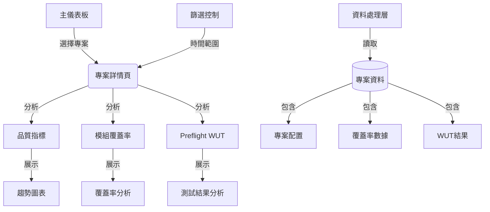

# 軟體品質儀表板系統設計文件

## 1. 系統架構


## 2. 頁面布局

### 2.1 主頁面 (main.py)
- 專案清單展示
- 專案狀態概覽
- 快速導航功能

### 2.2 專案詳情頁面 (project.py)
#### 頂部區域
- 專案標題
- 專案描述
- 時間範圍選擇器（側邊欄）

#### 關鍵指標區
- 測試執行數
- 測試通過數
- 通過率
- 開放缺陷數
- 嚴重缺陷
- 代碼覆蓋率

#### 分析頁籤
1. 品質指標趨勢
   - 通過率和覆蓋率趨勢圖

2. 模組覆蓋率
   - 覆蓋率趨勢圖
   - 覆蓋率統計摘要（展開面板）
   - 覆蓋率區間趨勢（展開面板）
   - 覆蓋率熱力圖（展開面板）
   - 週期性分析（展開面板）

3. Preflight WUT 分析
   - 每日分析（堆疊長條圖）
   - 累積趨勢分析（面積圖）
     * 日/週/月累積趨勢
     * 成功率趨勢
     * 失敗率趨勢
   - 失敗原因分析
     * 失敗類型分布（圓餅圖）
     * 失敗趨勢（堆疊面積圖）
   - 時間分布分析
     * 小時分布（熱力圖）
     * 星期分布（熱力圖）

#### 日趨勢分析區
1. 單日模組覆蓋率
   - 堆疊直條圖
   - 詳細數據表格

2. 單日模組覆蓋率分析
   - 泡泡圖
   - 變化速率分析

## 3. 技術架構
| 層級 | 技術選擇 | 說明 |
|------|----------|------|
| 前端框架 | Streamlit | 資料應用開發框架 |
| 數據處理 | Pandas | 數據分析與處理 |
| 視覺化 | Plotly | 互動式圖表庫 |
| 數據存儲 | CSV/JSON | 本地文件儲存 |
| 配置管理 | JSON | 專案設定檔 |

## 4. 數據結構

### 4.1 專案配置 (config.json)
```json
{
    "description": "專案描述",
    "metrics": {
        "Test_Executed": {
            "threshold": 100,
            "higher_better": true
        },
        "Pass_Rate(%)": {
            "threshold": 80,
            "higher_better": true
        },
        "Code_Coverage": {
            "threshold": 60,
            "higher_better": true
        }
    }
}
```

### 4.2 模組覆蓋率數據 (module_coverage.csv)
- date: 日期
- module_name: 模組名稱
- covered_line_number: 已覆蓋行數
- total_line_number: 總行數
- coverage_percentage: 覆蓋率百分比

### 4.3 Preflight WUT結果 (preflight_wut_result.csv)
- date: 日期
- type: 結果類型 (pass/build_fail/wut_fail)

### 4.4 品質指標數據 (sample_qa_dashboard.csv)
- Date: 日期
- Test_Executed: 測試執行數
- Test_Passed: 測試通過數
- Pass_Rate(%): 通過率
- Open_Bugs: 開放缺陷數
- Critical_Bugs: 嚴重缺陷數
- Code_Coverage: 代碼覆蓋率

## 5. 數據處理流程

### 5.1 數據讀取
- 使用 pandas 讀取 CSV 文件
- 日期時間格式轉換
- 數據有效性驗證

### 5.2 數據轉換
- 時間維度轉換（日/週/月）
- 數據聚合與統計
- 指標計算

### 5.3 視覺化處理
- 數據格式轉換
- 圖表配置優化
- 交互功能實現

## 6. 擴展性設計

### 6.1 新增專案支援
- 標準化數據格式
- 配置文件模板
- 自動化數據驗證

### 6.2 新增分析維度
- 模組化的圖表組件
- 可配置的指標定義
- 靈活的數據轉換器

### 6.3 客製化支援
- 可配置的閾值
- 自定義視覺主題
- 靈活的布局調整

## 7. 性能優化

### 7.1 數據處理優化
- 數據快取機制
- 延遲加載策略
- 數據預處理

### 7.2 視覺化優化
- 數據採樣
- 動態加載
- 圖表重用
