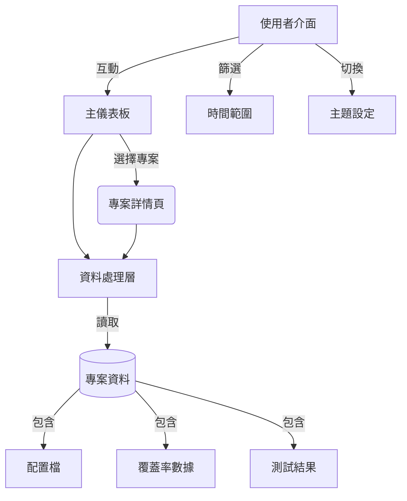
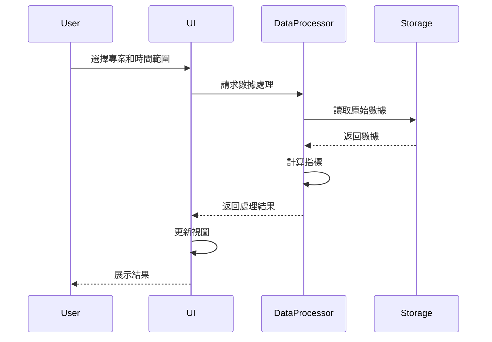

# 軟體品質儀表板系統設計文件

## 1. 系統架構


## 2. 技術架構
| 層級 | 技術選擇 | 說明 |
|------|----------|------|
| 前端框架 | Streamlit 1.28+ | 快速構建數據應用 |
| 數據處理 | Pandas 2.0+ | 高效數據操作與分析 |
| 視覺化 | Plotly 5.15+ | 互動式圖表 |
| 數據存儲 | CSV/JSON | 本地文件存儲 |
| 版本控制 | Git | 代碼版本管理 |
| 測試框架 | Pytest | 單元測試與整合測試 |
| 日誌系統 | Python logging | 應用日誌記錄 |

## 3. 核心模組設計

### 3.1 數據處理層
```python
# 模組職責：
# - 數據載入與驗證
# - 指標計算
# - 數據轉換

class DataProcessor:
    def load_project_data(self, project_id: str) -> pd.DataFrame:
        """載入專案數據"""
        pass

    def calculate_metrics(self, df: pd.DataFrame) -> Dict:
        """計算品質指標"""
        pass

    def transform_for_visualization(self, data: Dict) -> Dict:
        """數據可視化轉換"""
        pass
```

### 3.2 視圖層
```python
# 模組職責：
# - 頁面路由
# - 數據展示
# - 使用者互動

class DashboardView:
    def render_overview(self, projects: List[str]):
        """渲染總覽頁面"""
        pass

    def render_project_detail(self, project_id: str):
        """渲染專案詳情"""
        pass

    def handle_user_interaction(self, event: Dict):
        """處理使用者互動"""
        pass
```

### 3.3 配置管理
```python
# 模組職責：
# - 讀取配置
# - 參數驗證
# - 動態更新

class ConfigManager:
    def load_config(self, project_id: str) -> Dict:
        """載入專案配置"""
        pass

    def validate_config(self, config: Dict) -> bool:
        """驗證配置有效性"""
        pass

    def update_config(self, project_id: str, updates: Dict):
        """更新專案配置"""
        pass
```

## 4. 資料流程


## 5. 系統配置

### 5.1 專案配置結構
```json
{
    "metrics": {
        "測試通過率": {
            "threshold": 90,
            "higher_better": true
        },
        "代碼覆蓋率": {
            "threshold": 80,
            "higher_better": true
        }
    },
    "weights": {
        "測試通過率": 0.4,
        "代碼覆蓋率": 0.6
    }
}
```

### 5.2 日誌配置
- 日誌級別: DEBUG, INFO, WARNING, ERROR
- 日誌輪轉: 每日建立新檔案
- 保留期限: 7天

## 6. 部署架構

### 6.1 開發環境
- 本機 Streamlit 伺服器
- 虛擬環境隔離
- 即時重載支援

### 6.2 生產環境
- Docker 容器化部署
- 反向代理配置
- 資源使用限制

### 6.3 監控方案
- 應用日誌分析
- 性能指標收集
- 錯誤追蹤

## 7. 安全性考慮
- 數據讀取權限控制
- 配置文件存取限制
- 敏感資訊加密
- 輸入驗證與清理

## 8. 擴展性設計
- 模組化架構
- 插件系統支援
- 外部系統整合接口
- 客製化視圖支援
