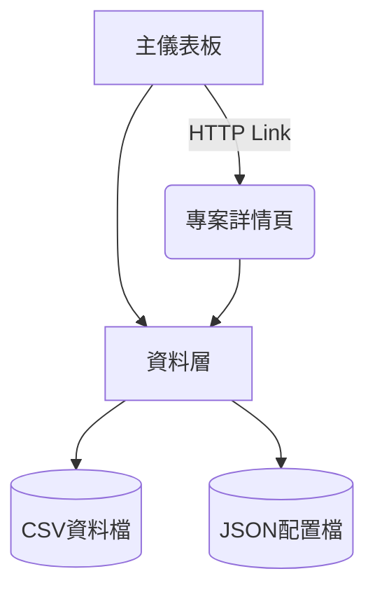
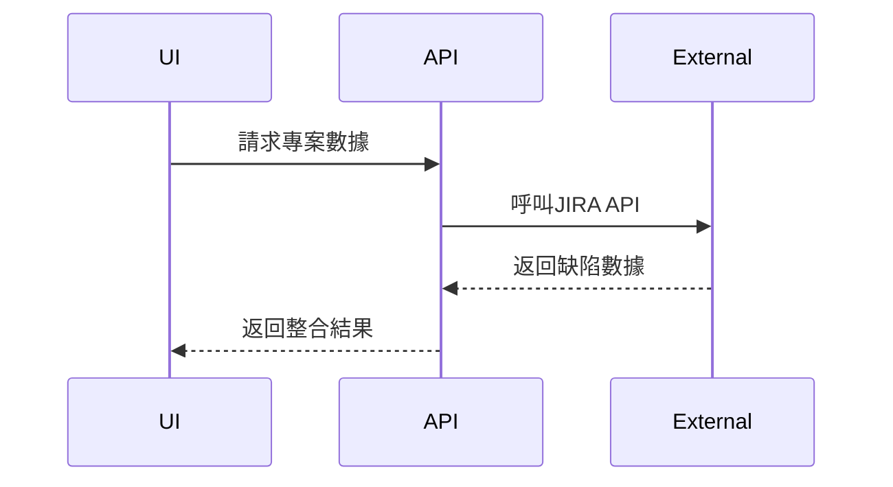

# 軟體品質儀表板系統設計

## 1. 架構概覽


## 2. 技術堆疊
| 組件 | 技術選擇 | 說明 |
|------|----------|------|
| 前端框架 | Streamlit | 快速開發互動式儀表板 |
| 數據處理 | Pandas | 數據清洗與分析 |
| 視覺化 | Plotly | 互動式圖表生成 |
| 配置管理 | JSON | 專案參數設定 |

## 3. 核心模組設計
### 3.1 主儀表板 (app.py)
- **功能**:
  - 多專案品質指標比較
  - 趨勢分析圖表
  - 互動式篩選控制

- **設計要點**:
  ```python
  def load_projects():
      # 載入多專案數據
      pass

  def render_metrics():
      # 渲染KPI卡片
      pass
  ```

### 3.2 專案詳情頁 (project.py)
- **功能**:
  - 顯示完整專案說明
  - 模組覆蓋率分析
  - 里程碑追蹤

- **API設計**:
  ```python
  @app.route('/project/<id>')
  def get_project_details(id):
      # 取得專案詳細資料
      pass
  ```

## 4. 擴充接口設計


## 5. 部署架構
- 開發模式: 本地Streamlit伺服器
- 生產模式: Docker容器化部署
- 數據流程: CSV → Pandas → Streamlit元件
