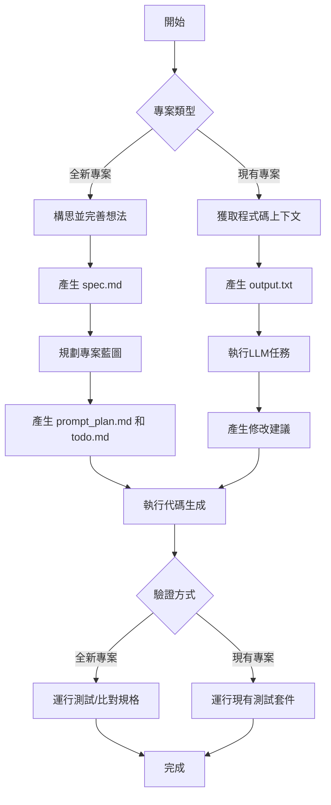

# My LLM Codegen Workflow



## 核心流程
1. **構思階段** (適用於全新專案)
   - 使用對話式LLM逐步完善想法
   - 產出詳細規格 spec.md
   ```mermaid
   flowchart LR
       A[初始想法] --> B[LLM對話完善]
       B --> C[規格文件 spec.md]
   ```

2. **規劃階段**
   - 將規格轉換為可執行計劃
   - 產生 prompt_plan.md 和 todo.md
   ```mermaid
   flowchart TD
       A[spec.md] --> B[分解需求]
       B --> C[建立執行步驟]
       C --> D[prompt_plan.md]
       C --> E[todo.md]
   ```

3. **執行階段**
   - 使用代碼生成工具實作
   - 兩種主要工作模式:
   ```mermaid
   graph LR
       A[執行方式] --> B[Claude結對編程]
       A --> C[Aider自動化]
       B --> D[手動驗證]
       C --> E[自動測試]
   ```

4. **驗證階段**
   - 確保代碼品質和功能正確性
   ```mermaid
   flowchart LR
       A[驗證] --> B[運行測試]
       A --> C[代碼審查]
       A --> D[功能測試]
       A --> E[文件檢查]
   ```

## 工具鏈
- **對話LLM**: ChatGPT 4o, Claude 3
- **代碼生成**: Aider, Claude Engineer
- **上下文管理**: repomix, mise
- **測試框架**: 依專案而定

## 最佳實踐
1. 保持迭代小步前進
2. 嚴格追蹤進度(todo.md)
3. 每個步驟後驗證結果
4. 優先考慮可測試性
5. 維持清晰的上下文邊界


若要開始根據 Harper Reed 的文章《My LLM codegen workflow atm》進行實驗並確認成果，你可以依照文章中描述的兩種主要情境（全新專案和現有專案的迭代）來操作。

首先，文章的摘要提到一個核心流程：**腦力激盪規格、然後規劃方案、然後使用 LLM codegen 執行。離散的迴圈。然後是魔法**。

### 全新專案 (Greenfield)

若你想要從一個全新的專案開始實驗，可以依照以下步驟進行：

1.  **構思並完善想法 (Idea honing)**：
    *   使用對話式 LLM（作者提到使用 ChatGPT 4o / o3）來逐步完善你的想法。
    *   你需要以一次一個問題的方式與 LLM 互動，確保每個問題都建立在你之前的回答之上。
    *   最終目標是產出一個詳細的規格，可以交給開發人員。
    *   在腦力激盪結束時，要求 LLM 將討論結果編譯成一個全面的、開發人員可用的規格，包含所有相關需求、架構選擇、資料處理細節、錯誤處理策略和測試計畫。
    *   這個規格應該儲存為 `spec.md` 檔案。
    *   你可以使用這個規格來做許多事情，例如請推理模型找出潛在問題、產生白皮書或商業模式。

2.  **規劃 (Planning)**：
    *   將上一步產生的 `spec.md` 檔案提供給一個適當的推理模型（作者提到 `o1*`、`o3*`、`r1`）。
    *   根據規格草擬一個詳細的、逐步的專案藍圖。
    *   將這個藍圖分解成小的、可迭代的程式碼塊，這些程式碼塊應彼此建立。
    *   進一步將這些程式碼塊分解成更小的步驟。
    *   審查這些步驟，確保它們足夠小，可以安全地實施並進行強大的測試，但又足夠大，可以推動專案向前發展。
    *   重複這個迭代過程，直到你認為這些步驟的大小適合你的專案為止。
    *   這個步驟的最終目標是輸出一系列可以提供給程式碼生成 LLM 的提示 (prompts)，以測試驅動的方式實施每個步驟。
    *   確保每個提示都建立在前一個提示之上，並以將程式碼片段連接在一起結束，避免產生未整合的孤立程式碼。
    *   輸出的提示計畫應該儲存為 `prompt_plan.md` 檔案。
    *   同時，要求 LLM 輸出一個 `todo.md` 檔案作為檢查清單。這個檔案可以用來追蹤你的進度。

3.  **執行 (Execution)**：
    *   根據你的 `prompt_plan.md` 檔案中的提示，使用程式碼生成工具來執行。作者提到他使用過 github workspace、aider、cursor、claude engineer、sweep.dev、chatgpt、claude.ai 等。
    *   作者個人偏好 **raw Claude** 和 **aider**。
    *   **使用 Claude** 的流程類似於結對程式設計：
        *   設定好你的專案儲存庫（建立樣板、初始化環境等）.
        *   將 `prompt_plan.md` 中的一個提示複製並貼到 claude.ai 中.
        *   將 Claude 生成的程式碼複製並貼到你的 IDE 中.
        *   執行程式碼、執行測試等.
        *   如果程式碼可以工作，則移動到下一個提示.
        *   如果程式碼無法工作，可以使用 `repomix` 將程式碼庫傳遞給 Claude 進行偵錯.
        *   重複以上步驟.
    *   **使用 Aider** 的流程更自動化：
        *   設定好你的專案儲存庫.
        *   啟動 aider.
        *   將 `prompt_plan.md` 中的一個提示貼到 aider 中.
        *   Aider 會自動執行程式碼和測試，或者你可以手動運行應用程式來驗證.
        *   如果程式碼可以工作，則移動到下一個提示.
        *   如果程式碼無法工作，可以與 aider 進行問答來修復問題.
        *   重複以上步驟.
    *   在執行過程中，你可以使用 `todo.md` 來追蹤哪些步驟已經完成。你的程式碼產生工具應該能夠在處理時勾選 `todo.md` 中的項目。

### 現有專案的迭代 (Non-greenfield)

若你想要在現有的程式碼基礎上進行實驗，可以採取稍微不同的方法：

1.  **獲取上下文 (Get context)**：
    *   你需要一個工具來抓取你的原始程式碼並有效地將其提供給 LLM。
    *   作者目前使用一個名為 **repomix** 的工具，並在 `~/.config/mise/config.toml` 中定義了任務集合。
    *   你可以使用 `mise run LLM:clean_bundles` 來生成包含程式碼庫上下文的 `output.txt` 檔案。如果檔案太大，你可以編輯命令以忽略不相關的部分。
    *   `mise` 的一個優點是可以在工作目錄的 `.mise.toml` 檔案中重新定義和重載任務，允許你使用不同的工具來打包程式碼，只要它能生成 `output.txt` 檔案即可。

2.  **執行 LLM 任務**：
    *   一旦生成了 `output.txt`，你可以使用 `mise run` 命令將其傳遞給 LLM 以執行各種任務，例如產生程式碼審查、GitHub issue、遺失的測試或 README 檔案。
    *   例如，要產生遺失的測試，你可以運行 `mise run LLM:generate_missing_tests`。這會生成一個包含建議的遺失測試的 markdown 檔案（例如 `missing-tests.md`）。

3.  **使用 Claude 或 Aider 實施變更**：
    *   **Claude**:
        *   導航到程式碼所在的目錄。
        *   運行 `mise run LLM:generate_missing_tests`。
        *   查看生成的 markdown 檔案 (`missing-tests.md`)。
        *   使用 `mise run LLM:copy_buffer_bundle` 抓取程式碼的完整上下文。
        *   將上下文和第一個遺失測試的「issue」貼到 Claude 中。
        *   將 Claude 生成的程式碼複製到你的 IDE 中。
        *   運行測試並重複這個過程。
    *   **Aider**:
        *   導航到程式碼所在的目錄，並確保你在一個新的分支上。
        *   運行 `aider`。
        *   運行 `mise run LLM:generate_missing_tests`。
        *   查看生成的 markdown 檔案 (`missing-tests.md`)。
        *   將第一個遺失測試的「issue」貼到 aider 中。
        *   讓 aider 自動處理（運行測試、偵錯等），然後重複這個過程。

### 確認成果

確認實驗成果的方式取決於你執行的具體任務，但一般來說可以包括：

*   **對於全新專案**：
    *   **運行生成的程式碼**：確保程式碼能夠按照你的規格運行，並且沒有明顯的錯誤。
    *   **執行測試**：如果你在規劃階段包含了測試計畫並生成了測試程式碼，務必執行這些測試以驗證程式碼的正確性。Aider 可以自動運行測試。
    *   **比對規格**：檢查最終的程式碼是否符合你在第一步中定義的規格。
    *   **檢查 `todo.md`**：確認所有規劃的步驟都已完成。

*   **對於現有專案的迭代**：
    *   **運行測試**：在你使用 LLM 生成或修改程式碼後，務必運行現有的測試套件，並確認所有測試仍然通過。對於新增的遺失測試，也要確保它們能夠成功運行。
    *   **程式碼審查**：你可以使用 LLM 產生程式碼審查 (`LLM:generate_code_review`)，以評估 LLM 生成的程式碼品質。
    *   **驗證功能**：手動測試你修改或新增的功能，確保它們按照預期工作。
    *   **檢查產生的檔案**：例如，如果你要求 LLM 產生 README 檔案，請檢查其內容是否準確和完整。

總之，開始實驗的關鍵是先選擇一個你想要嘗試的情境（全新專案或現有專案），然後仔細遵循文章中描述的步驟，並使用作者推薦的工具（例如 ChatGPT、Claude、Aider、repomix 和 mise）。**在每個步驟之後，都要驗證 LLM 的輸出，並進行測試以確保程式碼的品質和正確性**。作者也強調了**積極追蹤進度**的重要性，避免「over my skis」（超越自己的能力範圍而迷失方向）。
