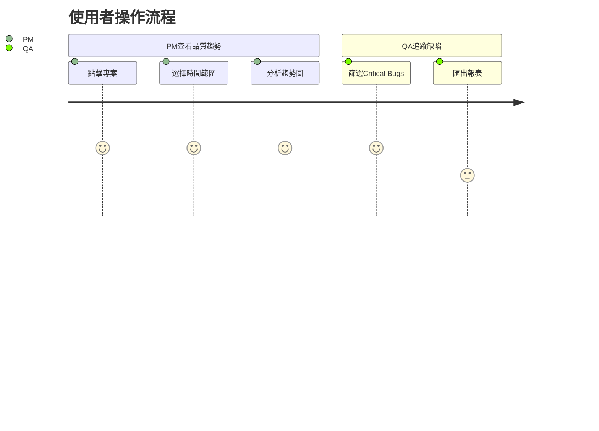

# 軟體品質儀表板需求規格書

## 1. 核心需求
- [x] 多專案品質指標監控
- [x] 即時數據視覺化
- [x] 測試覆蓋率分析
- [x] 缺陷追蹤管理

## 2. 功能需求
### 2.1 儀表板功能
- [x] KPI摘要卡片區 (測試通過率、缺陷數等)
- [x] 趨勢圖表分析 (15/30/60/90天)
- [x] 互動式篩選控制
- [x] 暗色/亮色主題切換

### 2.2 專案詳情功能  
- [x] 專案說明文件展示
- [x] 模組覆蓋率分析 (後端API預留)
- [x] 里程碑追蹤

### 2.3 系統整合
- [ ] JIRA缺陷同步 (擴充接口)
- [ ] GitHub整合 (擴充接口)

## 3. 非功能需求
- 效能: 支援同時載入10+專案數據
- 可用性: 99.9% 正常運作時間  
- 安全性: 資料本地儲存加密
- 擴充性: 模組化架構設計

## 4. 使用案例

## 5. 未來擴充
- 即時團隊通知功能
- 自動化報表生成  
- 多租戶支援
