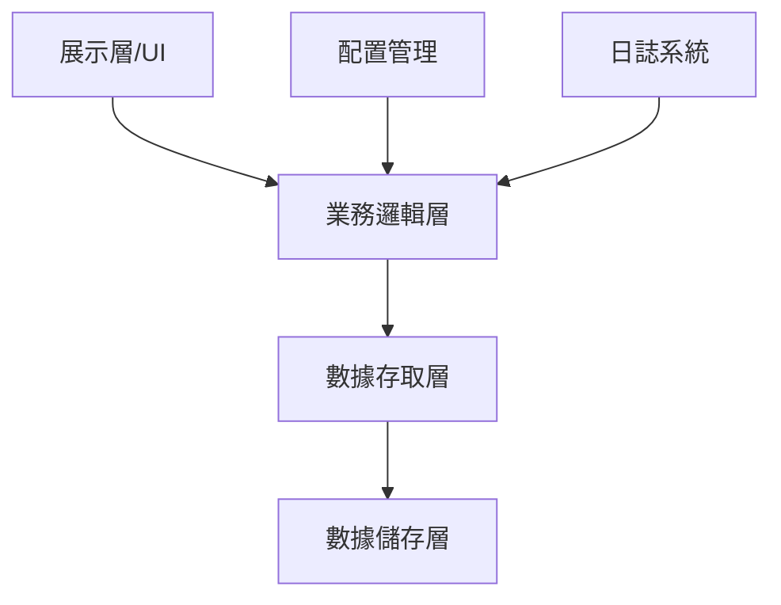

# Software Quality Dashboard 系統架構文件

## 1. 系統概述
### 1.1 目標與範疇
- 建立統一的軟體品質監控平台
- 支援多專案品質指標追蹤
- 提供即時的品質評估與預警
- 促進團隊協作與品質透明度

### 1.2 主要功能
- 多維度品質指標儀表板
- 專案間品質比較與分析
- 自動化品質評分機制
- 客製化報告生成功能

## 2. 架構設計
### 2.1 系統層級


### 2.2 核心模組
1. **主程式 (app.py)**
   - 初始化設定 (logging, 頁面配置)
   - 資料載入與處理
   - 使用者介面 (Streamlit)
   - 圖表生成 (Plotly)
   - 路由管理
   - 狀態管理

2. **資料處理模組**
   - load_preflight_wut_data(): 載入並處理preflight測試結果
   - load_module_coverage(): 載入模組覆蓋率數據
   - load_all_projects(): 載入所有專案數據
   - transform_data(): 數據轉換與預處理
   - validate_data(): 數據驗證與清理

3. **工具模組 (utils/)**
   - quality_metrics.py: 品質分數計算與評級
   - project_config.py: 專案配置管理
   - data_generator.py: 測試數據生成
   - visualization.py: 圖表生成輔助函數

4. **視圖模組 (views/)**
   - main.py: 主頁面視圖
   - project.py: 專案詳情視圖
   - components/: 可重用元件

### 2.3 數據模型
```python
class ProjectMetrics:
    project_id: str
    metrics: Dict[str, float]  # 各項指標數值
    thresholds: Dict[str, float]  # 指標閾值
    history: List[MetricSnapshot]  # 歷史數據
    
class MetricSnapshot:
    timestamp: datetime
    metrics: Dict[str, float]
    
class QualityScore:
    score: float  # 0-100
    grade: str    # A-E
    factors: Dict[str, float]  # 影響因素權重
```

## 3. 資料流程
### 3.1 數據處理流程
1. CSV檔案數據載入
2. 數據驗證與清理
3. 指標計算與轉換
4. 資料分組與聚合
5. 視覺化準備

### 3.2 品質評分流程
1. 載入專案配置
2. 收集原始指標
3. 標準化處理
4. 權重計算
5. 評分與評級

## 4. 技術堆疊
### 4.1 核心框架
- Streamlit 1.28+: Web應用框架
- Pandas 2.0+: 數據處理引擎
- Plotly 5.15+: 互動式視覺化
- NumPy: 數值計算支援

### 4.2 開發工具
- Python 3.8+: 主要開發語言
- Git: 版本控制
- VSCode: 開發環境
- pytest: 測試框架

### 4.3 部署相關
- Docker: 容器化部署
- Nginx: 反向代理（可選）
- GitHub Actions: CI/CD（可選）

## 5. 系統配置
### 5.1 日誌系統
- 等級: DEBUG, INFO, WARNING, ERROR
- 輪轉: 每日新檔案
- 保留期: 7天
- 格式: JSON結構化

### 5.2 監控指標
- 系統健康度
- 數據處理時間
- 記憶體使用量
- API響應時間

## 6. 安全考量
### 6.1 數據安全
- 檔案讀寫權限控制
- 數據備份機制
- 敏感信息加密

### 6.2 應用安全
- 輸入驗證
- 錯誤處理
- 日誌脫敏

## 7. 擴展性設計
### 7.1 插件系統
- 自定義指標計算
- 外部數據源集成
- 客製化視圖元件

### 7.2 整合接口
- REST API支援
- 事件觸發機制
- 外部系統回調

## 8. 部署指南
### 8.1 環境需求
- Python 3.8+
- 8GB+ RAM
- 現代網頁瀏覽器

### 8.2 安裝步驟
1. 克隆代碼庫
2. 安裝依賴包
3. 配置環境變數
4. 初始化數據
5. 啟動服務

## 9. 效能優化
### 9.1 數據處理優化
- 數據快取機制
- 批量處理
- 非同步載入

### 9.2 前端優化
- 延遲加載
- 數據分頁
- 局部更新

## 10. 未來規劃
### 10.1 短期目標
- 效能優化
- UI/UX改進
- 新增更多圖表類型

### 10.2 長期規劃
- 機器學習預測
- 多語言支援
- 移動端適配
